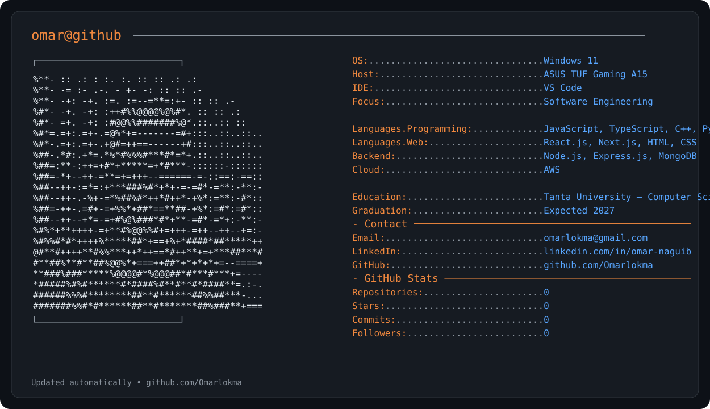

<div align="center">



</div>

## 👨‍💻 About

Computer Science student at **Tanta University** and Software Engineer focused on building modern, scalable web applications.

I mainly work with **React.js, TypeScript, JavaScript, Node.js and REST APIs**, while continuously expanding my backend and cloud engineering skills.

- 🎓 Computer Science — Tanta University
- 💻 Software Engineering / Web Development
- ⚛️ React.js & TypeScript
- 🟢 Node.js & Express.js
- ☁️ AWS Certified Cloud Practitioner
- 🚀 Interested in full-stack development, clean architecture and scalable systems

## 🧰 Tech Stack

```text
Frontend    → React.js · Next.js · TypeScript · JavaScript · HTML · CSS
Backend     → Node.js · Express.js · REST APIs
Database    → MongoDB · MySQL
Cloud       → AWS
Tools       → Git · GitHub · VS Code · Docker
```

## 📌 Featured Projects

| Project | Description | Stack |
| --- | --- | --- |
| 🎬 Movie App | Movie & TV browsing application using the TMDB API | React · TypeScript · REST API |
| ⚽ Futbolio | Football-focused web application with API integration and caching | React · API-Football |
| 📚 Course Management API | RESTful course management backend using MVC and MongoDB | Node.js · Express · MongoDB |
| 🌍 REST Countries | Responsive country information application | React · REST API |

## 🏆 Certification

**AWS Certified Cloud Practitioner**

## 📫 Contact

- LinkedIn: [linkedin.com/in/omar-naguib](https://www.linkedin.com/in/omar-naguib)
- GitHub: [github.com/Omarlokma](https://github.com/Omarlokma)
- Email: `omarlokma@gmail.com`

---

<div align="center">

**Building. Learning. Improving.**

</div>
